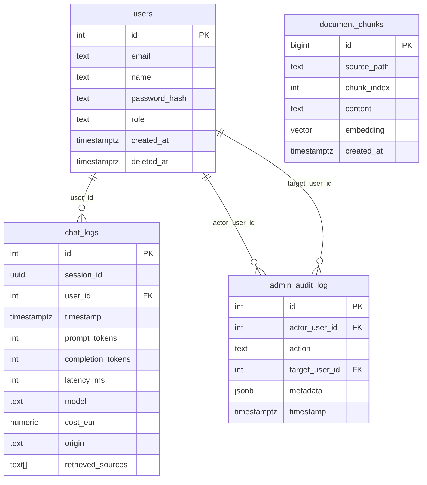

# Data Model

All tables live in the same PostgreSQL 16 instance as the pgvector extension. Schema is applied idempotently at startup via `ensure_schema_at_startup()` in `backend/app/db_util.py`.

---

## document_chunks

Stores the RAG knowledge base. Each Markdown file is split into overlapping chunks, embedded by Mistral, and inserted here. Populated by `make dev-data`.

| Column | Type | Notes |
|---|---|---|
| `id` | BIGSERIAL PK | |
| `source_path` | TEXT NOT NULL | Relative path of the source `.md` file (e.g. `calendar2025-2026.md`) |
| `chunk_index` | INT NOT NULL | Position of the chunk within the file |
| `content` | TEXT NOT NULL | Raw text of the chunk |
| `embedding` | vector(1024) NOT NULL | Mistral embedding — dimension controlled by `MISTRAL_EMBED_DIM` |
| `created_at` | TIMESTAMPTZ | Default `NOW()` |

Constraint: `UNIQUE (source_path, chunk_index)`. Ingest replaces all chunks for a given file (`DELETE … WHERE source_path = %s` then batch insert).

---

## users

Dashboard admin and staff accounts. Passwords are stored as bcrypt hashes. Deletion is soft — rows are never removed.

| Column | Type | Notes |
|---|---|---|
| `id` | SERIAL PK | |
| `email` | TEXT NOT NULL UNIQUE | |
| `name` | TEXT | Optional display name, editable by admins |
| `password_hash` | TEXT NOT NULL | bcrypt via passlib |
| `role` | TEXT NOT NULL | `CHECK (role IN ('admin', 'staff'))` |
| `created_at` | TIMESTAMPTZ | Default `NOW()` |
| `deleted_at` | TIMESTAMPTZ | NULL = active; set on soft-delete |

All queries filter `WHERE deleted_at IS NULL` to exclude deactivated accounts.

---

## chat_logs

One row per chat turn. Written as a background task on every successful `/api/v1/chat` response.

| Column | Type | Notes |
|---|---|---|
| `id` | SERIAL PK | |
| `session_id` | UUID NOT NULL | Browser-generated UUID, stable for a browser session |
| `user_id` | INT → users(id) | NULL when sent from the public chat (no login) |
| `timestamp` | TIMESTAMPTZ | Default `NOW()` |
| `prompt_tokens` | INT NOT NULL | Tokens in the user prompt sent to Mistral |
| `completion_tokens` | INT NOT NULL | Tokens in Mistral's reply |
| `latency_ms` | INT NOT NULL | End-to-end latency of the Mistral call |
| `model` | TEXT NOT NULL | Mistral model name (e.g. `mistral-small-latest`) |
| `cost_eur` | NUMERIC(10,6) NOT NULL | Estimated cost in euros |
| `origin` | TEXT | Source of the request (`web`, `embed`, etc.) |
| `retrieved_sources` | TEXT[] | Deduplicated list of source_path values returned by the RAG pipeline |

Indexes: `timestamp`, `session_id`, `user_id`, `origin`, `(timestamp, model)`.

Rows older than `RETENTION_DAYS` (default 365) are purged nightly at 02:00 by the APScheduler job in `backend/app/scheduler.py`.

---

## admin_audit_log

Append-only record of admin actions (role changes, deletions, etc.). Not yet surfaced in the dashboard UI.

| Column | Type | Notes |
|---|---|---|
| `id` | SERIAL PK | |
| `actor_user_id` | INT → users(id) NOT NULL | Admin who performed the action |
| `action` | TEXT NOT NULL | e.g. `change_role`, `soft_delete` |
| `target_user_id` | INT → users(id) | User affected, NULL if target was deleted |
| `metadata` | JSONB | Extra context (old/new values, etc.) |
| `timestamp` | TIMESTAMPTZ | Default `NOW()` |

---

## Entity relationships

